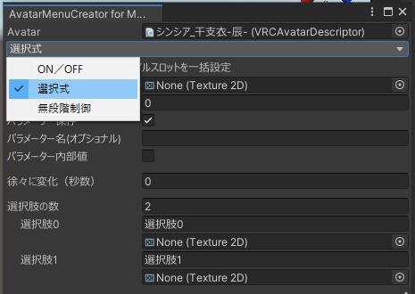

# Modular Avatarで着せ替えメニューを作ろう！

Avatar Menu Creator for MA +α の解説

# Modular Avatar (MA) は……

とても色々な事が出来……

- ボーンを統合できる（衣装を着せられる）: Merge Armature
- ボーンに追従できる（アクセサリを付けられる）: Bone Proxy
- Blendshape（シェイプキー）を同期出来る: Blendshape Sync
- Animator Controllerを統合できる: Merge Animator
- アンカーやBoundsを統一できる: Mesh Settings
- メニューを統合できる・作れる: Menu Installer / Menu Item etc.
- パラメーターを追加できる: Parameters
- PhysBoneの影響範囲を制御できる: PhysBone Blocker
- オブジェクトを丸ごと入れ替え: Replace Object
- 頭に付けた物が見えるようにできる: Visible Head Accessory
- ワールド固定できる: World Fixed Object

# Modular Avatar (MA) は……

- アニメーション（Animator Controller / Animation Clip）をいちから作れる……
  という仕組みは実はない

実は過去一瞬あったけど(1.5.0-beta-3付近)

<!--
---

# 着せ替えメニューにはアニメーションが必要

アニメーションも作ってくれるツール……

- Radial Inventory System？
- マジックドレッサーインベントリ？
- DressingTools？
- VRCFury (Toggle)？
- SmartCostume？
- Avatars 3.0 CustomSet？
- A3Box？
- xdressはよ
-->

# メニューとアニメーション一緒に作ってくれるやつ、作りました。

https://narazaka.booth.pm/items/4419509

# Avatar Menu Creator for MA

できます

- 操作
  - GameObjectのON/OFF
  - マテリアルの変更
  - Blendshapeの値
  - シェーダーパラメーターの値
- 個別ON/OFF（Bool）
- 複数メニューの切り換え（Int）
- 無段階変更（Float Radial Puppet）

# やっていきましょう

はじめに: インストール

基本ケース

1. 服をON/OFFしたい
2. 服の色を変更したい（複数マテリアルを入れ替えたい）
3. 胸のサイズを変えたい（Blendshapeを無段階で変えたい）
4. 服の透明度を変えたい（シェーダーパラメーターを無段階で変えたい）

+αツール編

1. メニューを階層化したい
2. 服同士の干渉を防止したい
3. 複数の切り換えをまとめたプリセットを作りたい

# やっていきましょう

応用ケース

1. ON/OFF時にフェードで切り換え
2. ON/OFFフェードと無段階変更の干渉対策
3. アセット生成してアニメーションを手動で編集
4. Quest対応時の方針
5. 旧バージョンのprefabから現バージョンのコンポーネントに復元

# はじめに: インストール

Boothに書いてます

**注意: Modular Avatarがインストールされてる前提です**

https://narazaka.booth.pm/items/4419509

# はじめに: インストール

サイト（ https://vpm.narazaka.net ）に行ってもらって

# はじめに: インストール

こういうのが出てくるかも

# はじめに: インストール

# はじめに: インストール

# 基本ケース

1. 服をON/OFFしたい
2. 服の色を変更したい（複数マテリアルを入れ替えたい）
3. 胸のサイズを変えたい（Blendshapeを無段階で変えたい）
4. 服の透明度を変えたい（シェーダーパラメーターを無段階で変えたい）

# 基本ケース1: 服をON/OFFしたい

# 基本ケース1: 服をON/OFFしたい

メニューからTools→Modular Avatar→AvatarMenuCreator for Modular Avatar

# 基本ケース1: 服をON/OFFしたい

ヒエラルキー上のアバターをツールにセット！

# 基本ケース1: 服をON/OFFしたい

アバター内のON/OFFしたいオブジェクトを選んで、

- 「ON=表示」を選ぶ & 「パラメーター初期値」をON

そして名前を付けて「Create!」

# 基本ケース1: 服をON/OFFしたい

アバター直下にメニューオブジェクトが出来ます。

アバター直下以外にも好きな所に入れて大丈夫です。

# 基本ケース1: 服をON/OFFしたい

オブジェクトには設定が保存されます。（あとから追加や変更が可能）

# 基本ケース1: 服をON/OFFしたい

これだけでON/OFFメニューが作れます。

# 基本ケース2: 服の色を変更したい （複数マテリアルを入れ替えたい）

# 基本ケース2: 服の色を変更したい

AvatarMenuCreatorウインドウのモードを「選択式」に変更します。

これで複数の選択肢を切り替えるメニューが作れます。

# 基本ケース2: 服の色を変更したい

# 基本ケース2: 服の色を変更したい

オブジェクトの「Materials」の横にある「＋」ボタンを押して、マテリアルスロットをチェックします。
（「同名～」が有効だと同じマテリアルのスロットが一括でチェックされて便利）

# 基本ケース2: 服の色を変更したい

「選択肢の数」を好きな数に変えて、名前とマテリアルをセット！

「Create!」をクリック！

# 基本ケース2: 服の色を変更したい

マテリアル選択メニューが完成！

# 基本ケース3: 胸のサイズを変えたい （Blendshapeを無段階で変えたい）

# 基本ケース3: 胸のサイズを変えたい

モードを「無段階制御」にします。

# 基本ケース3: 胸のサイズを変えたい

変えたいオブジェクトのBlendshape名を選択し、範囲を指定してCreate！

# 基本ケース3: 胸のサイズを変えたい

Radialメニューが完成！

# 基本ケース4: 服の透明度を変えたい （シェーダーパラメーターを無段階で変えたい）

# 基本ケース4: 服の透明度を変えたい

モードを同じく「無段階制御」にします。

# 基本ケース4: 服の透明度を変えたい

# 基本ケース4: 服の透明度を変えたい

変えたいオブジェクトのシェーダーパラメーター名を選択し、範囲を指定してCreate！

# 基本ケース4: 服の透明度を変えたい

Radialメニューが完成！

# 基本ケースまとめ

①ヒエラルキー上のアバターをツールにセット！

# 基本ケースまとめ

②オブジェクトを選ぶ→③モード選択→④設定する→⑤Create!で作成

組み合わせて色々出来ます。

# 基本ケースまとめ

例: オブジェクトをON/OFFするのと同時に干渉防止Blendshapeを操作

# ちなみに: オブジェクト毎のメニューいっぺんに作れます

# +αツール編

1. メニューを階層化したい
2. 服同士の干渉を防止したい
3. 複数の切り換えをまとめたプリセットを作りたい

# +αツール編1: メニューを階層化したい

# +αツール編1: メニューを階層化したい

# +αツール編1: メニューを階層化したい

メニューの階層化はModular Avatarの基本コンポーネントで出来ます！

# +αツール編1: メニューを階層化したい

アバターの下に親メニューとなる空オブジェクトを作ります。
（アバターのオブジェクトを右クリックして「Create Empty」）

# +αツール編1: メニューを階層化したい

親メニューオブジェクトにMA Menu InstallerとMA Menu Itemを付けて、以下のように設定します。

# +αツール編1: メニューを階層化したい

作ったメニューを親メニューオブジェクトの子階層にもってきます

# +αツール編1: メニューを階層化したい

メニューオブジェクトに付いているMA Menu Installerを削除します。

（削除して良いというヘルプと削除ボタンが出ているので押して下さい）

# +αツール編1: メニューを階層化したい

これでこの階層通りのメニューが出来ます。

# +αツール編2: 服同士の干渉を防止したい

# +αツール編2: 服同士の干渉を防止したい

- リボンは同時に使わない！
- 別の衣装は同時に出さない！
- 衣装のある部分を消すと衣装の別の部分が成立しない！

　　

# +αツール編2: 服同士の干渉を防止したい

**AvatarParametersDriver**

Expression Parameterを操作する`VRC Avatar Parameter Driver`を簡単に設定出来ます

https://narazaka.booth.pm/items/5465303

# +αツール編2: 服同士の干渉を防止したい

**AvatarParametersExclusiveGroup**

特にオブジェクト1つごとが干渉する場合に特化したツールです。

https://github.com/Narazaka/AvatarParametersExclusiveGroup

# +αツール編2: 服同士の干渉を防止したい

ようはこれをAnimatorいじらずにコンポーネント設定だけでつくるやつです。

 

# +αツール編2: 服同士の干渉を防止したい

インストールはVCCから（Avatar Menu Creator for MAと同じです）

# +αツール編2: 服同士の干渉を防止したい

たとえばこんなケース

1. セーラー服と水着と普段着を同時に出さない
2. セーラー服と上着が干渉するのでセーラー服有効なら上着を切る
3. 普段着にした時は上着をデフォルトON

# +αツール編2: 服同士の干渉を防止したい

# +αツール編3: 複数の切り換えをまとめたプリセットを作りたい

# +αツール編3: 複数の切り換えをまとめたプリセット

**AvatarParametersSaver**

https://github.com/Narazaka/AvatarParametersSaver

- 複数パラメーターをまとめて動かすプリセットを作れる
- Playしてパラメーターを設定出来る
- インストールは同じくVCCから

# +αツール編3: 複数の切り換えをまとめたプリセット

まずプリセットメニューを作ります

アバター内右クリックして「Modular Avatar」→「AvatarParametersPresets」

# +αツール編3: 複数の切り換えをまとめたプリセット

このままパラメーターの設定も可能ですが……

# +αツール編3: 複数の切り換えをまとめたプリセット

メニューから「Tools」→「Avatar Parameters Saver」

ウインドウに「Playしてください」と言われるのでシーンを再生すると……

# +αツール編3: 複数の切り換えをまとめたプリセット

実際にメニューを操作した状態を確認しながら設定出来ます

# +αツール編3: 複数の切り換えをまとめたプリセット

再生をやめるとプリセットに値が保持されているはずです。

# +αツール編3: 複数の切り換えをまとめたプリセット

プリセットメニューも出来ました！

# +αツール編まとめ

1. メニューの階層化にはModular Avatarの機能が使える
2. 衣装の干渉対策には**AvatarParametersDriver**と**AvatarParametersExclusiveGroup**が使える
3. プリセットメニューは**AvatarParametersSaver**で作れる

# 応用ケース

1. ON/OFF時にフェードで切り換え
2. ON/OFFフェードと無段階変更の干渉対策
3. アセット生成してアニメーションを手動で編集
4. Quest対応時の方針
5. 旧バージョンのprefabから現バージョンのコンポーネントに復元

# 応用ケース1: ON/OFF時にフェードで切り換え

- 「徐々に変化」を使い、ON/OFFと同時に透明度変更を設定します。
- マテリアルを透明シェーダーにするのを忘れずに

# 応用ケース2: ON/OFFフェードと無段階変更の干渉対策

- 無段階変更メニューでデフォルトパラメーター付近に無効領域を設定
- 無段階変更メニューをON/OFFメニューより下側に入れる（無段階変更メニューを優先）

　

# 応用ケース3: アセット生成してアニメーションを手動で編集

AvatarMenuCreatorで作ったメニューオブジェクトをprefabにすると、AnimationClipなどを直接生成することもできます。

「ON/OFFは手軽に作りたいけど特殊な条件を入れるためにAnimatorControllerをいじりたい！」などの場合に使えるかもしれません。

# 応用ケース4: Quest対応時の方針

PCとQuestでパラメーターのビット位置を同じにするためにメニューをそのままにする場合、prefab variantの継承先で操作内容のみ削除・変更すると良いと思います。

# 応用ケース5: 旧バージョンのprefabから現バージョンのコンポーネントに復元

Prefab内のMA ParametersかMerge Animatorのメニューから「AvatarMenuCreator for MA」→「アセット内容から設定を復元」でコンポーネントに出来ます。

# 応用ケースまとめ

- フェードして切り換え出来ます
- アニメーション生成ツールとしても使えます
- Quest対応でメニュー残す場合はprefab variantで内容変更とかで使えると思います
- 生成したprefabからコンポーネント内容を復元できます

# もういちどおさらい: 基本ケースまとめ！

①ヒエラルキー上のアバターをツールにセット！

# もういちどおさらい: 基本ケースまとめ！

②オブジェクトを選ぶ→③モード選択→④設定する→⑤Create!で作成

# もういちどおさらい: メニューを階層化したい

メニューの階層化はModular Avatarの基本コンポーネントで出来ます！

# 以上

- 便利だと思うので使ってみて下さい
- **Avatar Menu Creator for MA** = Modular Avatarネイティブでメニューを作るやつ
- **Avatar Parameters Driver** = 条件指定でパラメーターを動かせるやつ
- **Avatar Parameters Exclusive Group** = パラメーターを排他制御できるやつ
- **Avatar Parameters Saver** = プリセットメニュー作るやつ
- 奈良阪（narazaka）は他にも色々作ってます
  - 足が床に埋まるのを防ぐFloor Adjusterとか
  - ゆとるーむの浮くやつが作れるYUTOROOM Essentialsとか
  - [VPMリポジトリ](https://vpm.narazaka.net)や[Booth](https://narazaka.booth.pm)などのぞいてみてね。
